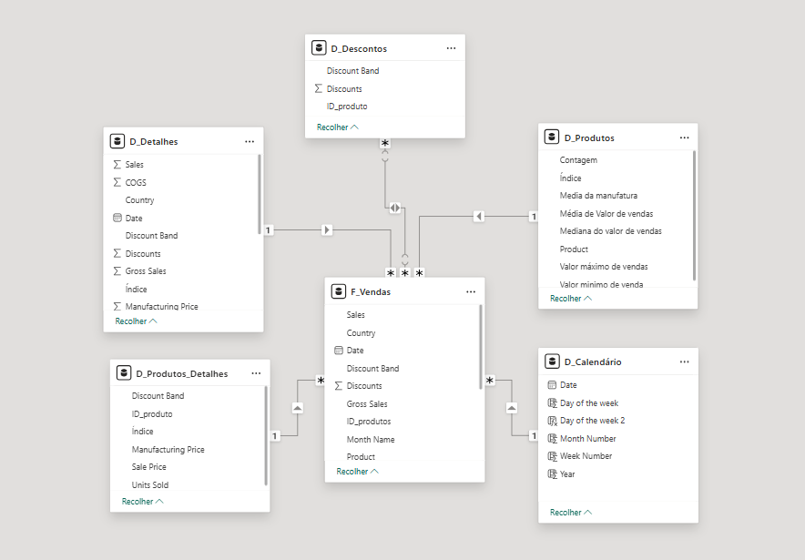

# Projeto: Modelagem Dimensional com Star Schema no Power BI

## Descrição do Projeto

Este projeto tem como objetivo transformar uma base de dados única (Financial Sample) em um modelo dimensional no formato **Star Schema**, utilizando o Power BI.

A proposta consiste em reorganizar os dados em tabelas fato e dimensão, permitindo uma análise mais eficiente, organizada e escalável.

---

## Objetivos

* Aplicar conceitos de modelagem dimensional
* Construir um modelo no formato estrela (Star Schema)
* Melhorar a performance e organização dos dados
* Utilizar funções DAX para enriquecimento do modelo
* Criar uma estrutura adequada para análise de dados

---

## Estrutura do Modelo

O modelo foi organizado em **7 tabelas**, sendo:

### Tabela Fato

**F_Vendas**
Contém os dados principais de vendas:

* Produto
* Quantidade vendida (Units Sold)
* Preço de venda (Sales Price)
* Desconto (Discount / Discount Band)
* Segmento
* País
* Vendas (Sales)
* Lucro (Profit)
* Data

---

### Tabelas Dimensão

**D_Produtos**
Tabela agregada com informações por produto:

* Produto
* Média de unidades vendidas
* Média de vendas
* Mediana de vendas
* Valor máximo e mínimo de vendas

---

**D_Produtos_Detalhes**
Tabela com informações mais específicas:

* Produto
* Faixa de desconto (Discount Band)
* Preço de venda
* Quantidade vendida
* Custo de fabricação

---

**D_Descontos**
Informações relacionadas a descontos:

* Produto
* Desconto
* Faixa de desconto

---

**D_Detalhes**
Contém atributos complementares:

* Segmento
* País
* Outras informações relevantes não contempladas nas demais dimensões

---

**D_Calendario**
Tabela de datas criada com DAX para suporte a análises temporais:

* Data
* Ano
* Mês
* Número do mês

---

### Tabela Auxiliar

**Financials**
Cópia da base original utilizada como backup (mantida oculta no modelo).

---

## Relacionamentos

O modelo segue o padrão **Star Schema**, onde:

* A tabela **F_Vendas** está no centro
* As tabelas dimensão se conectam a ela por relacionamentos **1:N (um para muitos)**
* Não há relacionamento direto entre dimensões

---

## Etapas de Desenvolvimento

1. Importação da base de dados (Financial Sample)
2. Criação de uma cópia da tabela original (backup)
3. Separação dos dados em tabelas dimensão
4. Criação da tabela fato (F_Vendas)
5. Criação da tabela calendário com DAX
6. Definição dos relacionamentos entre as tabelas
7. Organização visual do modelo em formato estrela

---

## Modelo Dimensional

